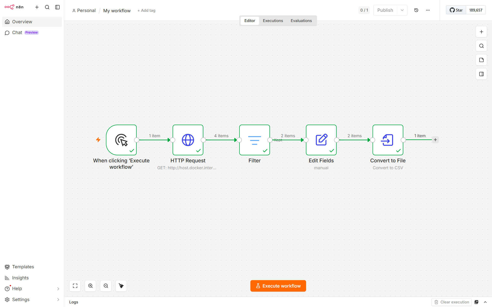

# Pipeline Automatizado de Auditoria Fiscal e Business Intelligence

Este projeto simula uma solução real de engenharia de dados e automação de processos internos para o setor de contabilidade/fiscal. A arquitetura integra uma API local, um orquestrador de fluxos de trabalho (ETL) conteinerizado e um painel de Business Intelligence para tomada de decisão.

## 🎛️ Arquitetura do Projeto

O fluxo de dados foi construído seguindo três camadas principais:
1. **Fonte de Dados (Produtor):** API REST desenvolvida em Python (Flask) que disponibiliza dados estruturados de faturamento, impostos e status de conformidade das empresas clientes.
2. **Orquestração e ETL (Cérebro):** Fluxo automatizado no n8n rodando via Docker. O fluxo consome a API, filtra registros com inconformidades operacionais ("Pendente") e trata as strings gerando alertas dinâmicos personalizados.
3. **Visualização (Consumidor):** Painel interativo construído no Google Looker Studio, alimentado pelos dados tratados pela automação para fornecer métricas consolidadas (Faturamento, Imposto Devido) e alertas à equipe interna.

## 📊 Dashboard Interativo

O painel executivo foi desenvolvido no Google Looker Studio e pode ser acessado de forma interativa através do link abaixo:

🔗 [Clique aqui para acessar o Dashboard no Looker Studio](https://datastudio.google.com/s/ugt1Cp3UH4Q)

## 📽️ Apresentação Executiva

Para uma visão detalhada sobre a estratégia, arquitetura e resultados deste projeto, acesse a apresentação interativa abaixo:

🔗 [Visualizar Apresentação do Projeto](https://auditoria-fiscal-bi-p2g4p97.gamma.site/)

## 🛠️ Tecnologias Utilizadas

* **Python (Flask)**
* **Docker**
* **n8n**
* **Google Looker Studio**
